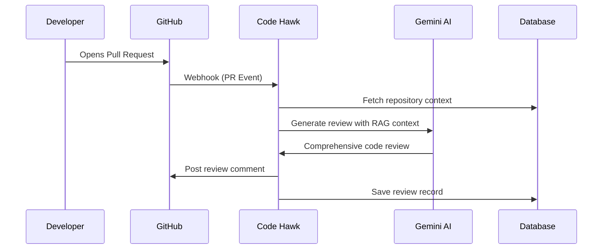

<div align="center">

# 🦅 Code Hawk

### AI-Powered Automated Code Review Platform

[](https://nextjs.org/)
[](https://www.typescriptlang.org/)
[](https://tailwindcss.com/)
[](https://www.prisma.io/)

_Supercharge your development workflow with intelligent, automated code reviews powered by Google Gemini AI_

[Features](#-features) • [Tech Stack](#-tech-stack) • [Getting Started](#-getting-started) • [Architecture](#-architecture) • [Contributing](#-contributing)

</div>

---

## 🚀 Features

### 🤖 AI-Powered Code Reviews

- **Automatic PR Analysis** — Instantly review pull requests when opened or synchronized
- **Context-Aware Reviews** — Uses RAG (Retrieval-Augmented Generation) with Pinecone vector database to understand your codebase
- **Comprehensive Feedback** — Get detailed walkthroughs, sequence diagrams, strengths, issues with severity levels, and actionable suggestions
- **Smart Prioritization** — Issues categorized by severity (Critical 🔴, Major 🟠, Minor 🟡, Nitpick 🔵)

### 📊 Developer Dashboard

- **Activity Overview** — Track commits, pull requests, and AI reviews with beautiful visualizations
- **Contribution Graph** — GitHub-style contribution heatmap for the current year
- **Monthly Analytics** — Bar charts showing monthly breakdown of development activity
- **Real-time Statistics** — View connected repositories, commits analyzed, and reviews generated

### 🔗 Seamless GitHub Integration

- **OAuth Authentication** — Secure login with GitHub via Better Auth
- **Webhook Automation** — Automatic webhook setup for connected repositories
- **Repository Management** — Connect, disconnect, and manage multiple repositories
- **Pull Request Tracking** — Monitor all PRs with their review status

### ⚡ Event-Driven Architecture

- **Background Processing** — Powered by Inngest for reliable, scalable job processing
- **Codebase Indexing** — Automatic indexing of repository files for context-aware reviews
- **Async Review Generation** — Non-blocking review generation with status tracking

---

## 🛠 Tech Stack

| Category       | Technologies                                                    |
| -------------- | --------------------------------------------------------------- |
| **Frontend**   | Next.js 16, React 19, TailwindCSS 4, Radix UI, Recharts, Motion |
| **Backend**    | Next.js API Routes, Server Actions                              |
| **Database**   | PostgreSQL with Prisma ORM 7                                    |
| **AI/ML**      | Google Gemini 2.5 Flash, AI SDK, Text Embeddings                |
| **Vector DB**  | Pinecone for semantic code search                               |
| **Auth**       | Better Auth with GitHub OAuth                                   |
| **Queue**      | Inngest for event-driven background jobs                        |
| **GitHub API** | Octokit for webhook and API integration                         |

---

## 📦 Getting Started

### Prerequisites

- Node.js 18+ or Bun
- PostgreSQL database
- GitHub OAuth App credentials
- Google AI API key
- Pinecone API key

### Installation

1. **Clone the repository**

   ```bash
   git clone https://github.com/yourusername/code-hawk.git
   cd code-hawk
   ```

2. **Install dependencies**

   ```bash
   bun install
   # or
   npm install
   ```

3. **Set up environment variables**

   ```bash
   cp .env.example .env
   ```

   Configure the following in `.env`:

   ```env
   # Database
   DATABASE_URL="postgresql://..."

   # Authentication
   BETTER_AUTH_SECRET="your-secret"
   GITHUB_CLIENT_ID="your-github-client-id"
   GITHUB_CLIENT_SECRET="your-github-client-secret"

   # AI Services
   GOOGLE_GENERATIVE_AI_API_KEY="your-google-ai-key"
   PINECONE_API_KEY="your-pinecone-key"
   PINECONE_INDEX="your-index-name"

   # App Configuration
   NEXT_PUBLIC_APP_BASE_URL="http://localhost:3000"
   ```

4. **Set up the database**

   ```bash
   npx prisma generate
   npx prisma db push
   ```

5. **Start the development server**

   ```bash
   bun dev
   # or
   npm run dev
   ```

6. **Start Inngest Dev Server** (in a separate terminal)

   ```bash
   npx inngest-cli@latest dev
   ```

7. Open [http://localhost:3000](http://localhost:3000) in your browser

---

## 🏗 Architecture

```
code-hawk/
├── app/                          # Next.js App Router
│   ├── (auth)/                   # Authentication pages
│   ├── api/                      # API routes
│   │   ├── auth/                 # Better Auth endpoints
│   │   ├── inngest/              # Inngest webhook handler
│   │   └── webhooks/github/      # GitHub webhook receiver
│   └── dashboard/                # Protected dashboard pages
│       ├── repository/           # Repository management
│       └── settings/             # User settings
│
├── components/                   # React components
│   └── ui/                       # Shadcn/ui components
│
├── hooks/                        # Custom React hooks
│
├── inngest/                      # Background job functions
│   ├── client.ts                 # Inngest client config
│   └── functions/
│       ├── index.ts              # Repository indexing
│       └── review.ts             # AI review generation
│
├── lib/                          # Shared utilities
│   ├── auth.ts                   # Better Auth configuration
│   ├── db.ts                     # Prisma client
│   └── pinecode.ts               # Pinecone client
│
├── module/                       # Feature modules
│   ├── ai/                       # AI review logic & RAG
│   ├── auth/                     # Auth components
│   ├── dashboard/                # Dashboard features
│   ├── github/                   # GitHub API integration
│   ├── repository/               # Repository CRUD
│   └── settings/                 # Settings management
│
└── prisma/
    └── schema.prisma             # Database schema
```

---

## 🔄 How It Works



1. **Connect Repository** — User authenticates with GitHub and connects their repositories
2. **Codebase Indexing** — Repository files are indexed and embedded in Pinecone for semantic search
3. **PR Webhook** — When a PR is opened/updated, GitHub sends a webhook to Code Hawk
4. **Context Retrieval** — Relevant code context is retrieved using RAG
5. **AI Review** — Google Gemini analyzes the diff with codebase context
6. **Review Posted** — Comprehensive review is posted as a PR comment

---

## 📝 Review Format

Code Hawk generates structured reviews including:

- 📝 **Walkthrough** — File-by-file breakdown of changes
- 🔄 **Sequence Diagram** — Mermaid.js visualization of code flow
- 📋 **Summary** — Concise overview of the PR
- ✅ **Strengths** — Highlights of good practices
- 🚨 **Issues & Concerns** — Severity-rated problems with solutions
- 💡 **Suggestions** — Actionable improvement recommendations
- 🎯 **Verdict** — APPROVE, REQUEST CHANGES, or NEEDS DISCUSSION
- 🎭 **Review Poem** — A creative touch to end the review!

---

## 🤝 Contributing

Contributions are welcome! Please feel free to submit a Pull Request.

1. Fork the repository
2. Create your feature branch (`git checkout -b feature/amazing-feature`)
3. Commit your changes (`git commit -m 'Add some amazing feature'`)
4. Push to the branch (`git push origin feature/amazing-feature`)
5. Open a Pull Request

---

## 📄 License

This project is licensed under the MIT License - see the [LICENSE](LICENSE) file for details.

---

<div align="center">

**Built with ❤️ by [Rizon Kumar](https://github.com/rizonkumar)**

⭐ Star this repo if you find it helpful!

</div>
